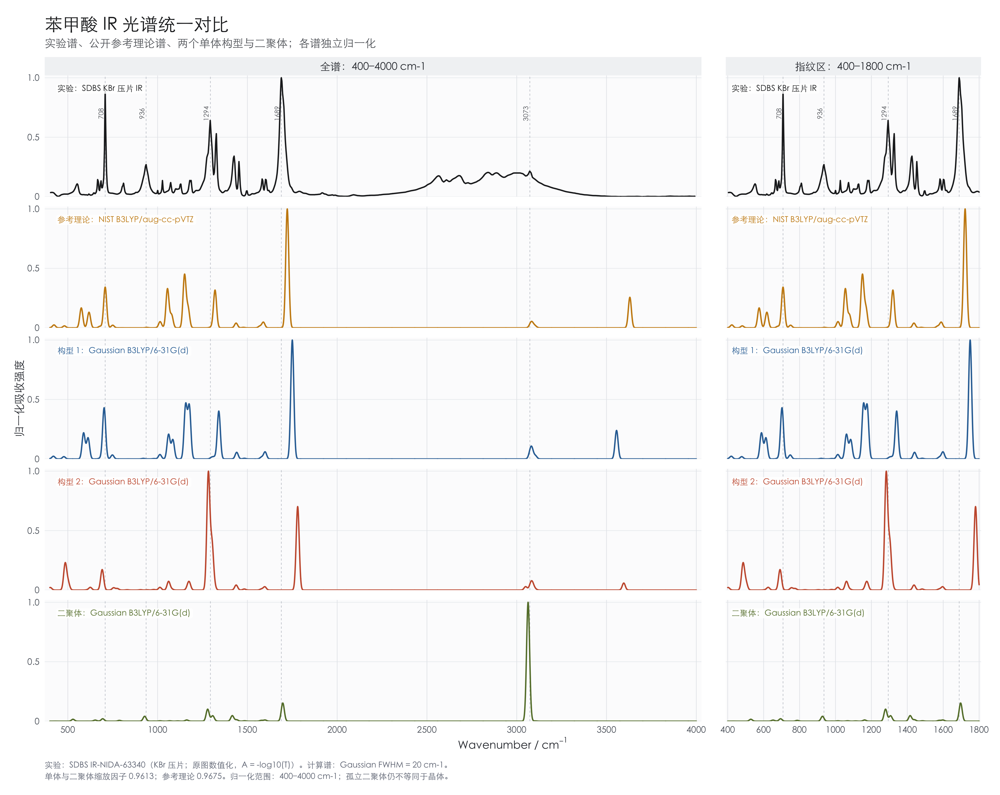
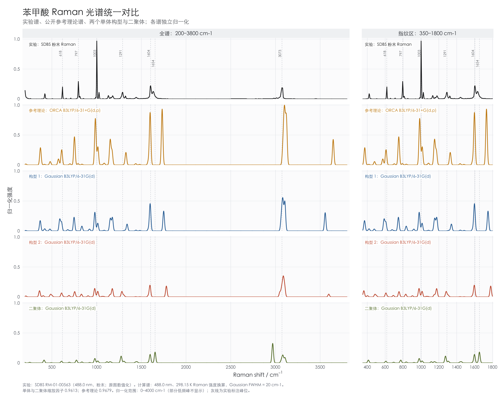

# 苯甲酸两个单体构型及氢键二聚体的红外与拉曼光谱计算

**实验报告**  
作者：叶青杨  
计算日期：2026 年 9 月 21 日

## 1 实验目的

本次实验以苯甲酸的两个单体构型及一个氢键二聚体为研究对象，在 B3LYP/6-31G(d) 水平下进行振动频率计算，比较其能量、红外光谱（IR）及拉曼光谱（Raman）。通过提取 Gaussian 输出中的频率、IR 强度和 Raman 活性，完成实验参考谱、公开理论参考谱、两个单体构型及二聚体计算谱的五组统一绘图。

实验主要包括以下内容：

1. 检查两个单体构型及二聚体的频率计算结果与局部稳定性。
2. 比较单体构型的相对能量，并按两个单体形成一个二聚体的计量关系估算缔合能。
3. 使用一致的缩放和展宽规则生成 IR 与 Raman 光谱，观察构型变化及二聚化引起的峰位和相对强度差异。
4. 检验显式引入分子间氢键后，哪些实验特征得到改善，以及孤立二聚体谐振模型仍有哪些局限。

## 2 实验步骤

### 2.1 几何优化与频率计算

两个单体构型的几何优化任务分别保存在 `Base1` 和 `Base2` 目录，输入文件采用 B3LYP/6-31G(d) 方法进行优化。对应的频率计算任务分别为 `Raman-chk1` 和 `Raman-chk2`。以下将两个单体分别记为构型 1 和构型 2。二聚体的优化及频率结果保存在 `double` 目录。

频率计算直接读取对应优化任务的检查点文件，避免重新输入坐标时发生精度截断。构型 1 的输入如下；构型 2 将 `%OldChk` 改为 `../Base2/job.chk`，其余设置相同。

```text
%NProcShared=5
%mem=28GB
%OldChk=../Base1/job.chk
%Chk=job.chk
#p B3LYP/6-31G(d) Freq=Raman Geom=AllCheck Guess=Read Int=UltraFine SCF=Tight
```

其中，`Geom=AllCheck` 和 `Guess=Read` 分别读取检查点中的几何结构及波函数初猜，`Freq=Raman` 计算振动频率及 Raman 活性，`Int=UltraFine` 和 `SCF=Tight` 分别指定积分网格与自洽场收敛精度。每个任务设置 5 核、28 GB 内存。

二聚体输入 `double/job.gjf` 采用以下路线，在同一任务中完成优化和频率计算；电荷为 0，多重度为 1，资源设置同样为 5 核、28 GB 内存。

```text
#p B3LYP/6-31G(d) Opt Freq=Raman
```

三个频率任务的主要积分网格标识均为 `IXCGrd=4, IRadAn=5`，SCF 密度矩阵 RMS 收敛阈值均为 $10^{-8}$。

计算完成后，检查输出中的 `Normal termination`、`Frequencies`、`IR Inten` 和 `Raman Activ`。苯甲酸单体分子式为 $\mathrm{C_7H_6O_2}$，含 15 个原子。对于非线性分子，振动自由度为

$$
N_{\mathrm{vib}}=3N-6=39.
$$

二聚体分子式为 $\mathrm{C_{14}H_{12}O_4}$，含 30 个原子，对应 $3\times30-6=84$ 个振动模式。84 不等于两个单体的 $2\times39=78$，其差额对应二聚体中新增的分子间相对运动自由度；实际正常模式仍可能相互耦合。

### 2.2 实验参考谱与理论参考谱

实验参考谱采用 AIST SDBS 中苯甲酸（SDBS No. 673）的记录：IR 为 KBr 压片谱 `IR-NIDA-63340`，Raman 为粉末谱 `RM-01-00563`，后者激发波长为 488.0 nm。[1] 两条实验参考曲线均由 SDBS 公开谱图数值化获得。

IR 理论参考采用 NIST CCCBDB 收录的 B3LYP/aug-cc-pVTZ 计算频率与 IR 强度。[2] Raman 理论参考采用 Parra Figueredo 等公开的 ORCA B3LYP/6-31+G(d,p) 频率与 Raman 活性。[3] 两种参考谱来自不同计算，不能视为同一结构、同一计算条件下的一对 IR 与 Raman 结果。

| 比较对象 | IR 数据来源 | Raman 数据来源 | 体系或条件 |
|---|---|---|---|
| 实验参考 | SDBS IR-NIDA-63340 | SDBS RM-01-00563 | KBr 压片 / 粉末 |
| 公开理论参考 | NIST B3LYP/aug-cc-pVTZ | ORCA B3LYP/6-31+G(d,p) | 孤立分子计算 |
| 构型 1 | Raman-chk1/job.out | Raman-chk1/job.out | Gaussian B3LYP/6-31G(d) |
| 构型 2 | Raman-chk2/job.out | Raman-chk2/job.out | Gaussian B3LYP/6-31G(d) |
| 二聚体 | double/job.out | double/job.out | Gaussian B3LYP/6-31G(d)，孤立氢键二聚体 |

**Table 1：本次光谱比较的数据来源。**

### 2.3 频率缩放与光谱展宽

两个单体构型及二聚体的谐振频率统一采用经验缩放因子 $s=0.9613$：[4]

$$
\tilde\nu_i^{\mathrm{scaled}}=s\tilde\nu_i^{\mathrm{harm}}.
$$

IR 理论参考使用 NIST 表列缩放频率，对应因子 0.9675；Raman 理论参考使用原文表列缩放频率，对应因子 0.9679。两者均不重复缩放。

该因子用于统一比较，并非专门针对二聚体氢键 O–H 振动重新拟合；不保证对强非谐模式同样准确。各计算模式采用高斯函数展宽，半高全宽（FWHM）统一设为 $20\ \mathrm{cm^{-1}}$。未归一化光谱写为

$$
Y(\tilde\nu)=\sum_i w_i\exp\left[-\frac{(\tilde\nu-\tilde\nu_i^{\mathrm{scaled}})^2}{2\sigma^2}\right],
\qquad
\sigma=\frac{20}{2\sqrt{2\ln 2}}\approx8.493\ \mathrm{cm^{-1}}.
$$

其中 $w_i$ 为 IR 强度或换算后的 Raman 相对强度。由于所有峰使用同一宽度，省略统一的高斯归一化系数不会改变最终独立归一化的谱形。全部计算模式均按统一的频率缩放与展宽规则处理。

### 2.4 IR 与 Raman 强度处理

实验 IR 原图的纵轴为透过率，将其换算为分数形式 $T$ 后，转换为吸光度：

$$
A=-\log_{10}T.
$$

数值化吸光度减去最小值后归一化，计算 IR 则直接以 Gaussian 或参考表中的 IR 强度为权重，展宽后归一化。这样五条 IR 曲线均以向上的吸收峰显示。二聚体与单体都按各自整套模式计算谱形，不将二聚体强度解释为等浓度或等质量样品的绝对强度。

Raman 活性与实验散射强度并不相同。本次统一按 488.0 nm 激发波长、298.15 K 温度进行相对 Stokes 强度换算：

$$
I_i\propto
\frac{S_i(\tilde\nu_0-\tilde\nu_i)^4}
{\tilde\nu_i\left[1-\exp\left(-\frac{hc\tilde\nu_i}{k_{\mathrm B}T}\right)\right]},
\qquad
\tilde\nu_0=\frac{10^7}{488.0}\ \mathrm{cm^{-1}}.
$$

其中 $S_i$ 为 Raman 活性，$\tilde\nu_i$ 使用缩放后的频率。Raman 强度换算采用 298.15 K 的模拟温度，该参数不作为实验温度的记录。比例常数在独立归一化后消去；IR 不使用这一 Raman 换算。

## 3 实验结果

### 3.1 计算状态与相对能量

两个单体频率任务均正常结束，各提取到 39 个振动模式；二聚体优化显示 `Optimization completed`，后续频率任务也正常结束，提取到 84 个振动模式。三个体系均无虚频。

| 项目 | 构型 1 | 构型 2 | 二聚体 |
|---|---:|---:|---:|
| 原子数 | 15 | 15 | 30 |
| 振动模式数 | 39 | 39 | 84 |
| 负频率数 | 0 | 0 | 0 |
| 最低谐振频率 / $\mathrm{cm^{-1}}$ | 69.5435 | 69.8614 | 18.3667 |
| 电子能 / Hartree | −420.822131922 | −420.810574136 | −841.676180552 |
| 电子能与零点能之和 / Hartree | −420.706217 | −420.695068 | −841.442691 |
| 焓 / Hartree | −420.698177 | −420.686940 | −841.426239 |
| Gibbs 自由能 / Hartree | −420.738228 | −420.727148 | −841.488711 |

**Table 2：两个单体构型及二聚体的频率计算结果与能量。** 二聚体与单体粒子数不同，不能直接比较绝对总能量高低。

Table 2 的零点校正及热力学数据直接读取 Gaussian 输出，未施加绘图用的频率缩放。热力学数据对应 298.15 K、1 atm 的 Gaussian 理想气体谐振近似。

以构型 1 为参照，定义 $\Delta X=X_2-X_1$，采用 $1\ \mathrm{Hartree}=2625.49962\ \mathrm{kJ\,mol^{-1}}$ 换算，得到：

| 能量比较 | 构型 2 相对构型 1 / $\mathrm{kJ\,mol^{-1}}$ |
|---|---:|
| $\Delta E_{\mathrm{elec}}$ | +30.34 |
| $\Delta(E_{\mathrm{elec}}+E_{\mathrm{ZPE}})$ | +29.27 |
| $\Delta H$ | +29.50 |
| $\Delta G$ | +29.09 |

**Table 3：同一计算水平下两个构型的相对能量。**

电子能、零点校正后的能量及自由能均支持构型 1 在本次孤立单体计算条件下更稳定。三个体系无虚频，支持它们在当前数值精度下为局部极小值；这不等同于已证明其中之一是所有可能结构中的全局最低点。

以两个优化后的构型 1 单体为参照，对反应 $2\mathrm M_1\rightarrow\mathrm D$ 定义

$$
\Delta X_{\mathrm{assoc}}=X_{\mathrm D}-2X_{\mathrm M_1}.
$$

| 缔合能量项目 | 数值 / $\mathrm{kJ\,mol^{-1}}$ |
|---|---:|
| $\Delta E_{\mathrm{elec,assoc}}$ | −83.80 |
| $\Delta(E_{\mathrm{elec}}+E_{\mathrm{ZPE}})_{\mathrm{assoc}}$ | −79.44 |
| $\Delta H_{\mathrm{assoc}}$ | −78.46 |
| $\Delta G_{\mathrm{assoc}}$ | −32.18 |

**Table 3a：形成每摩尔二聚体的缔合能量估计。** 这里比较优化后的二聚体与两个独立优化的单体，包含几何重排效应，不是固定片段几何下的纯相互作用能。结果未作基组重叠误差（BSSE）校正，热力学量采用输出中的 298.15 K、1 atm 理想气体刚性转子—谐振子近似。[Gaussian 热化学说明](https://gaussian.com/wp-content/uploads/dl/thermo.pdf)给出了此类热力学量的计算框架。[6] 由于二聚体存在很低的振动频率，自由能估计应谨慎使用；它不是固态或溶液中的缔合自由能，也不能直接用于推断实验样品中的二聚体比例。

二聚体最终结构中，两组 O–H···O 接触的 O···O 距离分别为 2.6789、2.6790 Å，H···O 距离分别为 1.6746、1.6747 Å，O–H···O 夹角约为 178.6°；对应的共价 O–H 键长约为 1.0045 Å。该几何结果支持环状双氢键二聚体的结构解释。

### 3.2 IR 光谱



**Figure 1：苯甲酸实验 IR、公开理论参考、两个单体构型及二聚体计算谱的比较。** 左列为 $400$—$4000\ \mathrm{cm^{-1}}$，右列为 $400$—$1800\ \mathrm{cm^{-1}}$。实验谱由 KBr 压片谱数值化并转换为相对吸光度。黑、金、蓝、橙、橄榄绿分别表示实验、参考理论、构型 1、构型 2 和二聚体；五组各占一行。

实验谱在约 $1689\ \mathrm{cm^{-1}}$ 附近具有显著吸收，数值化曲线的峰顶约为 $1688.4\ \mathrm{cm^{-1}}$，与这一参考位置一致。两个单体构型在羰基候选振动区的缩放频率分别约为 $1750.1$ 和 $1780.1\ \mathrm{cm^{-1}}$。二聚体对应的 IR 活性羰基耦合模式位于 $1697.2\ \mathrm{cm^{-1}}$（模式 72），相对 1689 的偏差约为 $+8.2\ \mathrm{cm^{-1}}$，明显小于两个单体的偏差。

二聚体在 $3062.2$ 和 $3064.4\ \mathrm{cm^{-1}}$ 处还有很强的 IR 活性模式，展宽后合并为约 $3063\ \mathrm{cm^{-1}}$ 的窄强峰。正常模式位移的 O–H 键向投影显示，两者均包含明显的 O–H 伸缩成分，并伴有 C–H 振动混合；不宜简单将这一峰全部归为芳香 C–H 伸缩。实验的高波数宽带仍未被固定宽度的谐振谱重现。

IR 各条曲线在 $400$—$4000\ \mathrm{cm^{-1}}$ 区间内分别归一化，不用于比较不同来源样品的绝对吸收量。

### 3.3 Raman 光谱



**Figure 2：苯甲酸实验 Raman、公开理论参考、两个单体构型及二聚体计算谱的比较。** 左列显示 $200$—$3800\ \mathrm{cm^{-1}}$，右列放大 $350$—$1800\ \mathrm{cm^{-1}}$；颜色与 Figure 1 一致。计算谱统一使用 488.0 nm、298.15 K 的相对强度换算。

实验 Raman 在约 $1003\ \mathrm{cm^{-1}}$ 处具有明显强峰，约 $797$、$1604$、$1654$ 及 $3073\ \mathrm{cm^{-1}}$ 附近亦有可辨识特征。

二聚体在 $1653.9\ \mathrm{cm^{-1}}$ 处存在 Raman 活性的羰基耦合模式（模式 71），接近实验的 1654 标注；两者相差约 $-0.1\ \mathrm{cm^{-1}}$，但这种数值接近不应解释为亚波数精度的预测。其芳环高频代表性模式为 $1598.6\ \mathrm{cm^{-1}}$，与两个单体的 $1598.7$ 和 $1596.9\ \mathrm{cm^{-1}}$ 相近。二聚体约 $980.6\ \mathrm{cm^{-1}}$ 的 Raman 活性模式仍低于实验 1003 强峰，且 $2969.2\ \mathrm{cm^{-1}}$ 的 O–H 伸缩相关计算峰较强，说明加入二聚体并未使全谱峰位与强度全部吻合。

Raman 计算谱在 $0$—$4000\ \mathrm{cm^{-1}}$ 网格上独立归一化后截取上述范围显示。低频强峰可能在显示范围外，因而显示部分的最大值不一定为 1。比较谱形时应注意这一归一化范围，不能据此认为构型 2 或二聚体的绝对 Raman 强度整体更弱。

## 4 实验分析与结论

### 4.1 构型变化与二聚化对振动频率的影响

两个单体构型在部分芳环相关区域的频率较为接近，而在羧基相关区域的差异较明显。加入二聚体后，羰基相关模式进一步发生耦合与频移。Table 4 列出代表性振动模式的缩放频率。

| 比较项目 | 实验参考 / $\mathrm{cm^{-1}}$ | 构型 1 / $\mathrm{cm^{-1}}$ | 构型 2 / $\mathrm{cm^{-1}}$ | 二聚体 / $\mathrm{cm^{-1}}$ |
|---|---|---:|---:|---|
| IR 羰基相关模式 | 1689 | 1750.1 | 1780.1 | 1697.2（模式 72） |
| Raman 羰基相关模式 | 1654 | 1750.1 | 1780.1 | 1653.9（模式 71） |
| Raman 芳环高频区代表性模式 | 1604 | 1598.7 | 1596.9 | 1598.6（模式 70） |
| O–H 伸缩相关模式 | 固态表现为宽带，不能一一对应 | 3555.9 | 3596.1 | 2969.2、3062.2、3064.4（含混合模式） |

**Table 4：代表性缩放频率与实验参考位置。** 单体模式按频率区间进行初步归属，二聚体模式 71、72、73、74、76 的归属结合正常模式键向位移分析。该分析限于代表性模式，不构成全部模式的势能分布分析或逐一实验归属。同一模式序号不保证不同体系之间性质相同。单体一个模式可同时具有 IR 和 Raman 活性，因此两个单体的羰基频率分别在两行重复，而二聚体的两行对应不同耦合模式。

IR 羰基区中，构型 1 与实验参考位置的差值约为 $+61.1\ \mathrm{cm^{-1}}$，构型 2 约为 $+91.1\ \mathrm{cm^{-1}}$。构型 2 的候选峰比构型 1 蓝移约 $30.0\ \mathrm{cm^{-1}}$，最高频模式则相差约 $40.2\ \mathrm{cm^{-1}}$。相比之下，两者接近 $1600\ \mathrm{cm^{-1}}$ 的代表性模式仅相差约 $1.7\ \mathrm{cm^{-1}}$。不同振动对构型变化的敏感程度因而有所区别。

二聚体模式 71、72 的两个 C=O 键向位移分别主要呈同相和反相组合，缩放频率相差 $43.3\ \mathrm{cm^{-1}}$。模式 71 的 Raman 活性为 283.0817 Å⁴/amu，IR 强度在输出精度下为 0；模式 72 的 IR 强度为 847.9886 km/mol，Raman 活性在输出精度下为 0。IR 与 Raman 在羰基区分别突出显示不同的耦合模式。由于 Gaussian 将优化后的近对称结构识别为 C1，这种互补特征依据实际正常模式位移及计算强度分析，不作为严格点群选择定则的证明。

### 4.2 二聚体改善了局部峰位，但仍不能代替固态谱

二聚体模型显式包含两个苯甲酸分子之间的双氢键。IR 羰基相关峰由构型 1 的 1750.1 降至二聚体的 $1697.2\ \mathrm{cm^{-1}}$，更接近实验 1689；Raman 羰基耦合峰也接近实验 1654。这些局部结果支持将分子间相互作用纳入解释，但二聚体依然是孤立的有限体系，没有描述整个晶体环境。

二聚体模式 73 的 O–H 键伸缩主要同相，位于 $2969.2\ \mathrm{cm^{-1}}$，具有较大的 Raman 活性；模式 74、76 的 O–H 反相伸缩成分与 C–H 振动混合，集中在 $3062$—$3064\ \mathrm{cm^{-1}}$，IR 强度较大。这与单体约 $3556$—$3596\ \mathrm{cm^{-1}}$ 的自由 O–H 候选模式明显不同。但计算仍将强度集中到少数窄峰，而实验表现为宽带。因此不能仅因频率降低，就认为 O–H 谱形已得到准确重现。

独立的喷射冷却二聚体研究也观察到，O–H 区即使在低温下仍具有宽广谱带及多个子峰，谐振单峰图像不足以解释；该工作讨论了非谐振动耦合的作用。[Florio 等的原始研究](https://doi.org/10.1039/b009594j)[5]表明非谐振动耦合是理解 O–H 谱带形状的重要因素。统一高斯展宽的谐振模型无法描述这种非谐耦合所产生的谱带结构。

二聚体的羰基区更接近实验，并不等于所有峰都更准确或相对强度全部改善。此外，公开理论参考仍为不同基组的孤立单体计算，比较时应保留这一体系差异。

### 4.3 峰位匹配与强度比较的限制

在 $1000\ \mathrm{cm^{-1}}$ 附近存在多个相邻的计算模式，它们的 Raman 活性和换算强度并不相同。仅选择与实验峰距离最近的频率，有可能把一个弱模式当作实验主峰的对应模式。因此，定量误差分析需以可靠的模式对应关系为前提。

若需进一步量化匹配程度，应先观察正常模式位移，按振动特征和强度筛选对应模式，再对明确的匹配关系统计频率偏差。还应区分波数校准误差、图像数值化误差、理论方法误差与样品状态差异。本次独立归一化的谱图不支持不同来源之间绝对 IR 或 Raman 强度的比较。

### 4.4 实验结论

本次实验在 B3LYP/6-31G(d) 水平下得到两个无虚频单体构型及一个无虚频二聚体，分别具有 39、39、84 个振动模式。构型 1 的电子能比构型 2 低 $30.34\ \mathrm{kJ\,mol^{-1}}$，在加入零点校正和热力学校正后仍保持较低能量。相对于两个构型 1 单体，二聚体未作 BSSE 校正的电子缔合能约为 $-83.80\ \mathrm{kJ\,mol^{-1}}$。

IR 与 Raman 光谱比较涵盖实验参考、公开理论参考、两个单体构型及二聚体。二聚体的 IR 羰基模式位于 $1697.2\ \mathrm{cm^{-1}}$，Raman 羰基模式位于 $1653.9\ \mathrm{cm^{-1}}$，分别接近实验 1689 和 1654 的特征；正常模式位移与强度显示二者是不同的耦合模式。二聚化对羧基相关谱峰的影响比对部分芳环模式更显著。

高波数 O–H 区的窄强峰及其他区域的频率和强度偏差仍然存在，不能据局部峰位接近认定全谱已准确重现，也不能单凭谱图外观确定晶体中的唯一结构。后续可进一步分析非谐性、晶体环境与完整模式归属，并在需要定量缔合能时补充 BSSE 及低频热力学校正。

## 5 附录

### 5.1 数据与脚本

本实验的数据、处理与绘图脚本及报告源文件归档于 GitHub 仓库：[populuscathayana/Quantum1](https://github.com/populuscathayana/Quantum1)。环境安装与复现步骤见仓库中的 [ENVIRONMENT.md](../ENVIRONMENT.md)，涵盖 Python、R 和 XeLaTeX；使用已保存的计算输出即可重建数据与谱图，无需安装量子化学计算软件。以下路径均相对于仓库根目录。

| 文件或目录 | 内容 |
|---|---|
| `Raman-chk1/job.out` | 构型 1 原始频率计算输出 |
| `Raman-chk2/job.out` | 构型 2 原始频率计算输出 |
| `double/job.out` | 二聚体原始优化与频率计算输出 |
| `IR-comparison/prepare_ir_data.py` | IR 提取、数值化及展宽 |
| `IR-comparison/plot_ir_comparison.R` | IR 统一绘图 |
| `IR-comparison/ir_spectra_normalized.csv` | IR 绘图曲线 |
| `IR-comparison/double_ir_modes.csv` | 二聚体 84 个模式的 IR 数据 |
| `Raman-comparison/prepare_raman_data.py` | Raman 提取、数值化及强度换算 |
| `Raman-comparison/plot_raman_comparison.R` | Raman 统一绘图 |
| `Raman-comparison/raman_spectra_normalized.csv` | Raman 绘图曲线 |
| `Raman-comparison/peaks_dimer.csv` | 二聚体 84 个模式的 Raman 数据 |
| `experiment-report/verify_results.py` | 能量、几何与二聚体键向位移核验脚本 |
| `experiment-report/verified_results.json` | 三个体系的能量、频率检查、缔合能及氢键几何 |
| `experiment-report/dimer_mode_bond_projections.csv` | 二聚体正常模式在选定 C=O、O–H 键方向的相对位移投影 |

**Table 5：本次计算结果与处理脚本。**

绘图的矢量文件为 [IR 对比图 PDF](../IR-comparison/ir_comparison.pdf) 和 [Raman 对比图 PDF](../Raman-comparison/raman_comparison.pdf)。

### 5.2 数值化与复现说明

SDBS 原图的横轴在部分区间采用不同的比例，数值化时分别校准各段。IR 原图的横向分辨率约为高波数区 $7.6\ \mathrm{cm^{-1}/pixel}$、低波数区 $3.8\ \mathrm{cm^{-1}/pixel}$，因此数值化峰位的小数不代表相应的实验精度。IR 数据保留透过率及吸光度，未对原始数据范围外的点进行外推。

重新绘图可在相应目录执行：

```bash
# IR-comparison 目录
python3 prepare_ir_data.py
Rscript plot_ir_comparison.R ir_spectra_normalized.csv ir_comparison

# Raman-comparison 目录
python3 prepare_raman_data.py \
  --chk1 ../Raman-chk1/job.out \
  --chk2 ../Raman-chk2/job.out \
  --dimer ../double/job.out \
  --output-dir .
Rscript plot_raman_comparison.R raman_spectra_normalized.csv raman_comparison

# Gau 工作目录：重建能量、几何及正常模式核验数据
python3 experiment-report/verify_results.py
```

Python 环境需要 NumPy 与 Pillow，R 环境需要 ggplot2。Raman 默认复用已保留的 `experimental_sdbs_digitized.csv`；若需重新数值化原图，可额外传入 `--sdbs-image /path/to/RM563.gif`。R 绘图脚本使用 macOS 字体及 Quartz PDF 输出，迁移到其他系统时需调整字体与图形设备。键向位移投影使用 Gaussian 打印的有限精度笛卡尔正常模式，适于定性检查同相、反相及参与键，不等同于完整的势能分布分析。

### 5.3 参考资料

[1] AIST. SDBSWeb: Benzoic acid, SDBS No. 673. IR-NIDA-63340; RM-01-00563. [数据库记录](https://sdbs.db.aist.go.jp/CompoundLanding.aspx?sdbsno=673)，访问日期：2026-09-21。

[2] NIST. Computational Chemistry Comparison and Benchmark Database. Benzoic acid, B3LYP/aug-cc-pVTZ. [计算记录](https://cccbdb.nist.gov/energy3x.asp?basis=18&casno=65850&method=8)，访问日期：2026-09-21。

[3] Parra Figueredo J G, González J, Perozo E, Iza P. A procedure for obtaining IR, Raman and NMR spectra of organic compounds by means of quantum mechanical calculations with the ORCA-5.0.3 software. *Educación Química*, 2023, 34(1). [DOI: 10.22201/fq.18708404e.2023.1.82742](https://doi.org/10.22201/fq.18708404e.2023.1.82742).

[4] Merrick J P, Moran D, Radom L. An Evaluation of Harmonic Vibrational Frequency Scale Factors. *The Journal of Physical Chemistry A*, 2007, 111: 11683–11700.

[5] Florio G M, Sibert E L III, Zwier T S. Fluorescence-dip IR spectra of jet-cooled benzoic acid dimer in its ground and first excited singlet states. *Faraday Discussions*, 2001, 118: 315–330. [DOI: 10.1039/b009594j](https://doi.org/10.1039/b009594j).

[6] Ochterski J W. Thermochemistry in Gaussian. Gaussian, Inc., 2000. [官方说明](https://gaussian.com/wp-content/uploads/dl/thermo.pdf).
